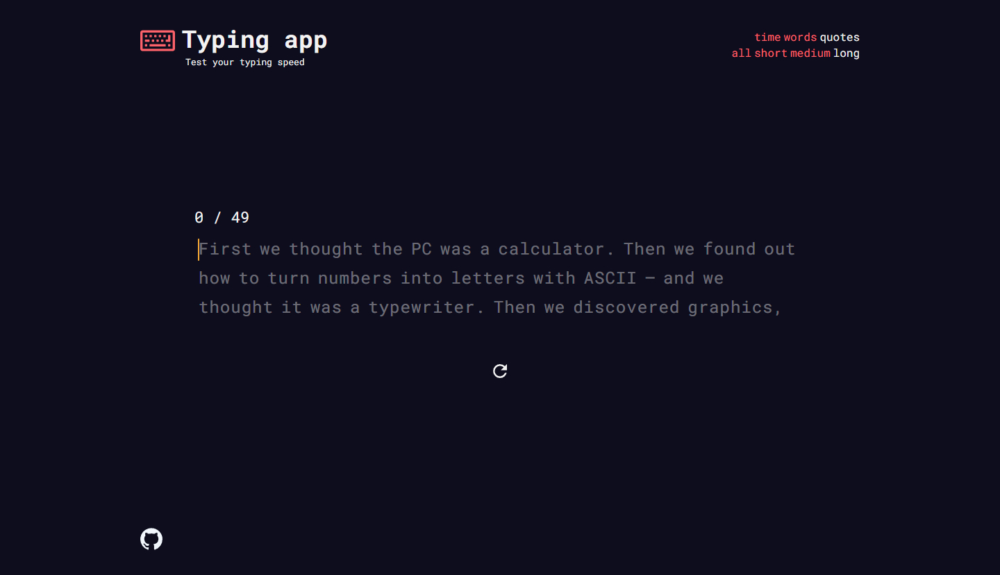

## About The Project



This project is inspired by [monkeytype](https://monkeytype.com/)

### Built with

- [React.js](https://reactjs.org/)
- [TypeScript](https://www.typescriptlang.org/)
- [Sass](https://sass-lang.com/)

## Getting Started

1. Clone the repo
```sh
git clone https://github.com/LukaKobaidze/typing-app
```
2. Install NPM packages
```sh
npm install
```
3. Run locally on localhost:3000
```sh
npm start
```

## Acknowledgments

- [random-words](https://github.com/apostrophecms/random-words)
