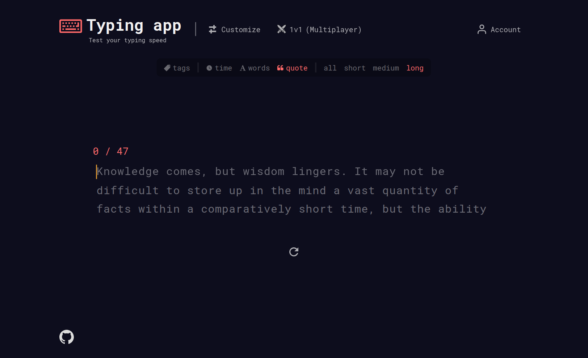

<details>
  <summary>Table of Contents</summary>
  <ul>
    <li>
      <a href="#about-the-project">About The Project</a>
      <ul>
        <li><a href="#description">Description</a></li>
        <li><a href="#built-with">Built With</a></li>
      </ul>
    </li>
    <li><a href="#getting-started">Getting Started</a></li>
    <li><a href="#acknowledgments">Acknowledgments</a></li>
  </ul>
</details>

## About The Project



### Built with

- [![TypeScript][typescript-image]][typescript-url]
- [![React][react-image]][react-url]
- [![Sass][sass-image]][sass-url]
- [![Node.js][nodejs-image]][nodejs-url]
- [![Express][express-image]][express-url]
- [![MongoDB][mongodb-image]][mongodb-url]
- [![Mongoose][mongoose-image]][mongoose-url]
- [![Socket.io][socketio-image]][socketio-url]

### Description

- Custom made smooth typing input that displays live errors.
- Different typing modes, such as 'time', 'words', 'quote'.
- Multiplayer 1v1 mode to play against your friends.
- Fetches Random quotes using 'quotable' API.
- Results after typing is done, including WPM, Accuracy, Errors, Interactive Dashboard.
- User can customize the app to their liking.
- Various app color themes.
- User can create account that will be saved on database.
- Personal stats, history and customizations will be saved to the account.


## Getting Started

1. Clone the repository, and move to the root directory of the project

```sh
git clone https://github.com/LukaKobaidze/typing-app
```

2. Add required environment variables to server

   Create .env file in server directory

```
  MONGODB_CONNECTION=<your-mongodb-connection-string>
  JWT_SECRET=<your-jwt-secret>
```

3. Install NPM packages (handles both client & server packages)

```sh
npm run install-all
```

4. Run the app locally

```sh
npm run dev
```

## Acknowledgments

- [random-words](https://github.com/apostrophecms/random-words)
- [quotable API](https://github.com/lukePeavey/quotable)
- Inspired by [monkeytype](https://monkeytype.com/)

[typescript-image]: https://shields.io/badge/TypeScript-3178C6?logo=TypeScript&logoColor=FFF&style=for-the-badge
[react-image]: https://img.shields.io/badge/React-20232A?style=for-the-badge&logo=react&logoColor=61DAFB
[sass-image]: https://img.shields.io/badge/Sass-CC6699?style=for-the-badge&logo=sass&logoColor=white
[nodejs-image]: https://img.shields.io/badge/Node.js-43853D?style=for-the-badge&logo=node.js&logoColor=white
[express-image]: https://img.shields.io/badge/Express-f5f5f5?&style=for-the-badge&logo=Express&logoColor=black
[mongodb-image]: https://img.shields.io/badge/MongoDB-011e2c?&style=for-the-badge&logo=mongodb&logoColor=01ed64
[mongoose-image]: https://img.shields.io/badge/Mongoose-880000?&style=for-the-badge&logo=mongoose&logoColor=ffffff
[socketio-image]: https://img.shields.io/badge/Socket.io-010101?&style=for-the-badge&logo=Socket.io&logoColor=white
[typescript-url]: https://www.typescriptlang.org/
[react-url]: https://react.dev/
[sass-url]: https://sass-lang.com/
[nodejs-url]: https://nodejs.org/en
[express-url]: https://expressjs.com/
[mongodb-url]: https://www.mongodb.com/
[mongoose-url]: https://mongoosejs.com/
[socketio-url]: https://socket.io/
