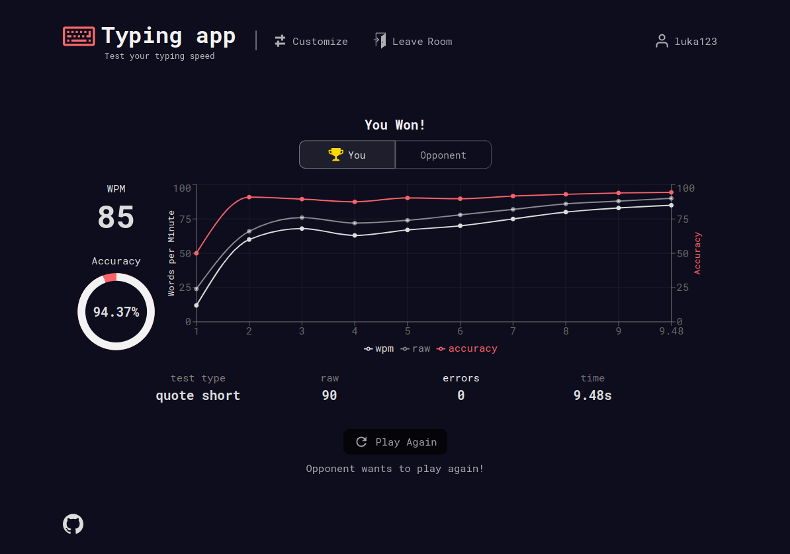

## Table of contents

- [About The Project](#about-the-project)
  - [Description](#description)
  - [Built with](#built-with)
- [Getting Started](#getting-started)
- [Acknowledgments](#acknowledgments)

## About The Project


### Built with

* [![React][https://img.shields.io/badge/React-20232A?style=for-the-badge&logo=react&logoColor=61DAFB]][https://react.dev/]
* [![TypeScript][https://shields.io/badge/TypeScript-3178C6?logo=TypeScript&logoColor=FFF&style=for-the-badge]][https://www.typescriptlang.org/]
* [![Sass][https://img.shields.io/badge/Sass-CC6699?style=for-the-badge&logo=sass&logoColor=white]][https://sass-lang.com/]
* [![Node.js][https://img.shields.io/badge/Node.js-43853D?style=for-the-badge&logo=node.js&logoColor=white]][https://nodejs.org/en]
* [![Socket.io][https://img.shields.io/badge/Socket.io-010101?&style=for-the-badge&logo=Socket.io&logoColor=white]][https://socket.io/]

* [React.js](https://reactjs.org/)
* [TypeScript](https://www.typescriptlang.org/)
* [Sass](https://sass-lang.com/)
* [Node.js](https://nodejs.org/en)
* [Socket.io](https://socket.io/)

### Description

- Custom made input with random words.
- Different typing modes, such as 'time', 'words', 'quote'.
- Multiplayer 1v1 Race mode to play against your friends.
- Fetches Random quotes using 'quotable' API.
- Displays live errors while typing.
- Results after typing is done, including WPM, Accuracy, Errors, Interactive Dashboard.
- User can customize the app to their liking.
- Various app themes.
- App tracks your overall typing stats, including average wpm, accuracy and more.



## Getting Started

1. Clone the repository, and move to the root directory of the project

```sh
git clone https://github.com/LukaKobaidze/typing-app
```

2. Install NPM packages (handles both client & server packages)

```sh
npm install
```

3. Run the app (handles both client & server)

```sh
npm start
```

## Acknowledgments

- [random-words](https://github.com/apostrophecms/random-words)
- [quotable API](https://github.com/lukePeavey/quotable)
- Inspired by [monkeytype](https://monkeytype.com/)
