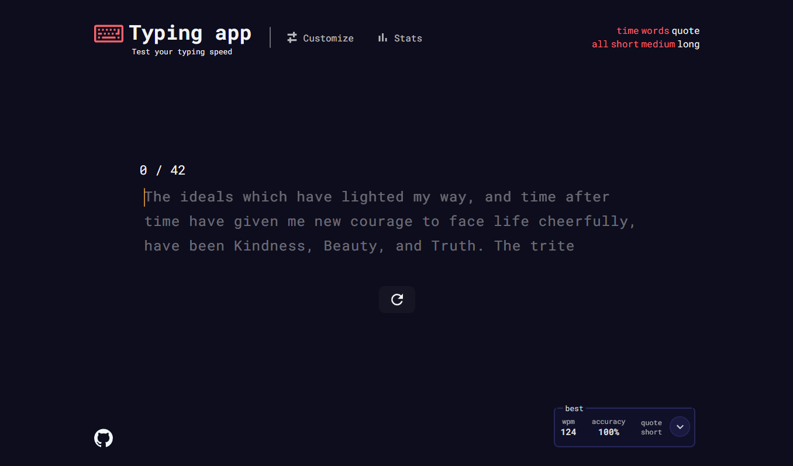
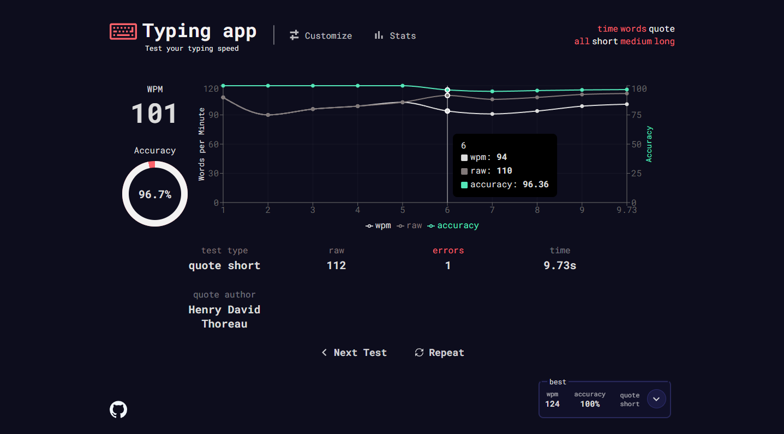

## About The Project

### Built with

- [React.js](https://reactjs.org/)
- [TypeScript](https://www.typescriptlang.org/)
- [Sass](https://sass-lang.com/)
- [Node.js](https://nodejs.org/en)
- [Socket.io](https://socket.io/)

### Description

- Custom made input with random words.
- Different typing modes, such as 'time', 'words', 'quote'.
- Multiplayer 1v1 Race mode to play against your friends.
- Fetches Random quotes using 'quotable' API.
- Displays live errors while typing.
- Results after typing is done, including WPM, Accuracy, Errors, Interactive Dashboard.
- User can customize the app to their liking.
- Various app themes.
- App tracks your overall typing stats, including average wpm, accuracy and more.

## Acknowledgments

- [random-words](https://github.com/apostrophecms/random-words)
- [quotable API](https://github.com/lukePeavey/quotable)
